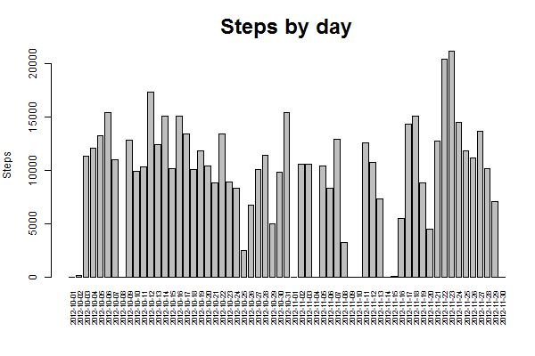
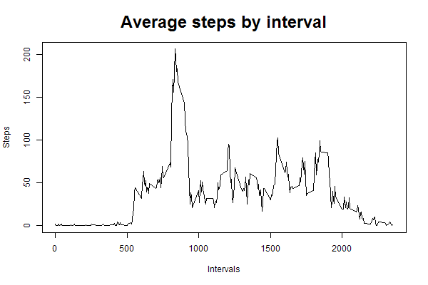
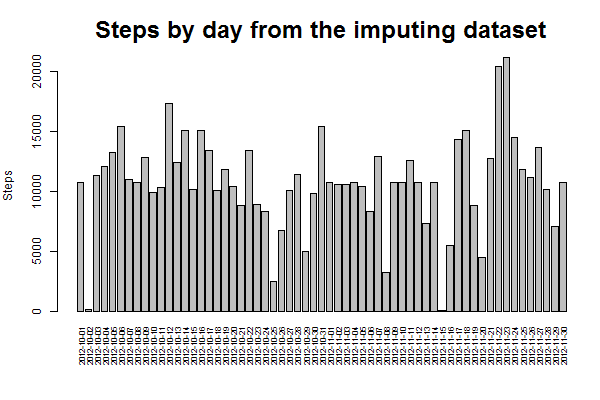
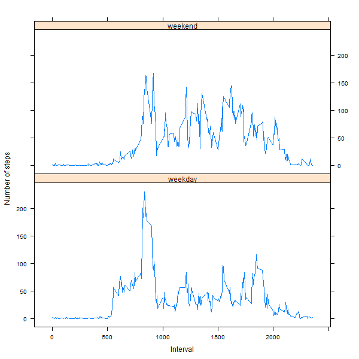

# Reproducible Research: Peer Assessment 1
## Introduction
This assignment makes use of data from a personal activity monitoring device. 
This device collects data at 5 minute intervals through out the day. The data 
consists of two months of data from an anonymous individual collected during 
the months of October and November, 2012 and include the number of steps taken 
in 5 minute intervals each day.

## Loading and preprocessing the data

```r
# download the data
fileurl <- "http://d396qusza40orc.cloudfront.net/repdata%2Fdata%2Factivity.zip"
destfile <- "repdata.zip"
download.file(fileurl, destfile)
unzip(destfile)
# read in the dataset
dat <- read.csv("activity.csv")
# change the 'data' variable to Date class
dat$date <- as.Date(dat$date)
str(dat)
```

```
## 'data.frame':	17568 obs. of  3 variables:
##  $ steps   : int  NA NA NA NA NA NA NA NA NA NA ...
##  $ date    : Date, format: "2012-10-01" "2012-10-01" ...
##  $ interval: int  0 5 10 15 20 25 30 35 40 45 ...
```


## What is mean total number of steps taken per day?
1. Calculate the total number of steps taken per day

```r
# calculate the total steps with tapply()
step.by.day <- with(dat, tapply(steps, date, sum, na.rm = T))
print(step.by.day)
```

```
## 2012-10-01 2012-10-02 2012-10-03 2012-10-04 2012-10-05 2012-10-06 
##          0        126      11352      12116      13294      15420 
## 2012-10-07 2012-10-08 2012-10-09 2012-10-10 2012-10-11 2012-10-12 
##      11015          0      12811       9900      10304      17382 
## 2012-10-13 2012-10-14 2012-10-15 2012-10-16 2012-10-17 2012-10-18 
##      12426      15098      10139      15084      13452      10056 
## 2012-10-19 2012-10-20 2012-10-21 2012-10-22 2012-10-23 2012-10-24 
##      11829      10395       8821      13460       8918       8355 
## 2012-10-25 2012-10-26 2012-10-27 2012-10-28 2012-10-29 2012-10-30 
##       2492       6778      10119      11458       5018       9819 
## 2012-10-31 2012-11-01 2012-11-02 2012-11-03 2012-11-04 2012-11-05 
##      15414          0      10600      10571          0      10439 
## 2012-11-06 2012-11-07 2012-11-08 2012-11-09 2012-11-10 2012-11-11 
##       8334      12883       3219          0          0      12608 
## 2012-11-12 2012-11-13 2012-11-14 2012-11-15 2012-11-16 2012-11-17 
##      10765       7336          0         41       5441      14339 
## 2012-11-18 2012-11-19 2012-11-20 2012-11-21 2012-11-22 2012-11-23 
##      15110       8841       4472      12787      20427      21194 
## 2012-11-24 2012-11-25 2012-11-26 2012-11-27 2012-11-28 2012-11-29 
##      14478      11834      11162      13646      10183       7047 
## 2012-11-30 
##          0
```

2. Make a histogram of the total number of steps taken each day

```r
# open a new png device
png("./figure/steps.by.day.png", width = 600, height = 400)
# set the margins
par(mar = c(6, 4, 4, 1))
# make the histogram with barplot()
barplot(step.by.day, las = 3, cex.names = .7, cex.main = 2,
	ylab = "Steps", main = "Steps by day")
dev.off()
```


3. Calculate the mean and median of the total number of steps taken per day

```r
# calculate the mean and median
step.mean <- mean(step.by.day)
step.median <- median(step.by.day)
cat("The mean and median of the total number of steps taken per day are", 
  step.mean, "and", step.median, "\n")
```

```
## The mean and median of the total number of steps taken per day are 9354.23 and 10395
```


## What is the average daily activity pattern?
1. Make a time series plot of the 5-minute interval and the average number of 
steps taken

```r
# calculate the average steps by intervals
step.by.interval <- with(dat, tapply(steps, interval, mean, na.rm = T))
# plot the line chart
png("./figure/steps.by.interval.png", width = 600, height = 400)
plot(names(step.by.interval), step.by.interval, type = "l", cex.main = 2,
	xlab = "Intervals", ylab = "Steps", main = "Average steps by interval")
dev.off()
```


2. Which 5-minute interval contains the maximum number of steps?

```r
cat("The", names(which.max(step.by.interval)), 
	"5-minute interval contains the maximum number of steps\n")
```

```
## The 835 5-minute interval contains the maximum number of steps
```


## Imputing missing values
1. Calculate and report the total number of missing values in the dataset

```r
# flag the NAs in the dataset
dat.na <- is.na(dat)
# calculate the number of rows with NAs
cat("The total number of rows with NAs is", sum(rowSums(dat.na) > 0), "\n")
```

```
## The total number of rows with NAs is 2304
```

2. Filling in all of the missing values with the mean for that 5-minute interval.

```r
# flag the NAs in steps
na.flag <- is.na(dat$steps)
# match the intervals with flags to the interval names in 'step.by.interval'
mt <- match(dat$interval[na.flag], names(step.by.interval))
fillna <- step.by.interval[mt]
```

3. Create a new dataset with the missing data filled in.

```r
# make a copy of 'dat'
dat.fillna <- dat
# replace the NAs with means for those 5-minute intervals
dat.fillna[na.flag, "steps"] <- fillna
# take a look
str(dat.fillna)
```

```
## 'data.frame':	17568 obs. of  3 variables:
##  $ steps   : num  1.717 0.3396 0.1321 0.1509 0.0755 ...
##  $ date    : Date, format: "2012-10-01" "2012-10-01" ...
##  $ interval: int  0 5 10 15 20 25 30 35 40 45 ...
```

```r
str(dat)
```

```
## 'data.frame':	17568 obs. of  3 variables:
##  $ steps   : int  NA NA NA NA NA NA NA NA NA NA ...
##  $ date    : Date, format: "2012-10-01" "2012-10-01" ...
##  $ interval: int  0 5 10 15 20 25 30 35 40 45 ...
```

4. Make a histogram of the total number of steps taken each day.

```r
# calculate the total number of steps taken each day
step.by.day.fillna <- with(dat.fillna, tapply(steps, date, sum, na.rm = T))
png("./figure/steps.by.day.fillna.png", width = 600, height = 400)
par(mar = c(6, 4, 4, 1))
barplot(step.by.day.fillna, las = 3, cex.names = .7, cex.main = 2,
	ylab = "Steps", main = "Steps by day from the imputing dataset")
dev.off()
```


5. Calculate the mean and median total number of steps taken per day

```r
step.mean.fillna <- mean(step.by.day.fillna)
step.median.fillna <- median(step.by.day.fillna)
cat("The mean and median of the total steps per day from the imputing dataset are", step.mean.fillna, "and", step.median.fillna, "\n\n")
cat("The mean and median from the orginal dataset are", 
	step.mean, "and", step.median, "\n")
```

```
## The mean and median of the total steps per day from the imputing dataset are 10766.19 and 10766.19 
## 
## The mean and median from the orginal dataset are 9354.23 and 10395
```


## Are there differences in activity patterns between weekdays and weekends?
1. Create a new factor variable in the dataset with two levels weekday and weekend.

```r
# add a 'weekday' variable with a default value of 'weekday'
dat.fillna$weekday <- factor("weekday", levels = c("weekday", "weekend"))
# flag the rows on Saturday or Sunday
mt <- weekdays(dat.fillna$date) %in% c("Saturday", "Sunday")
# change the 'weekday' in the selected rows to 'weekend'
dat.fillna[mt, "weekday"] <- "weekend"
table(dat.fillna$weekday)
```

```
## 
## weekday weekend 
##   12960    4608
```

2. Make a panel plot containing 5-minute interval and the average number of steps across all weekday days or weekend days. 

```r
# subset the imputing dataset based on the weekday
dat.weekday <- subset(dat.fillna, weekday == "weekday")
dat.weekend <- subset(dat.fillna, weekday == "weekend")
# calculate the average by interval
step.by.interval.weekday <- with(dat.weekday, tapply(steps, interval, mean))
step.by.interval.weekend <- with(dat.weekend, tapply(steps, interval, mean))
len.weekday <- length(step.by.interval.weekday)
len.weekend <- length(step.by.interval.weekend)
# built a data frame with steps and weekdays for
step.df <- data.frame(steps = c(step.by.interval.weekday, step.by.interval.weekend), 
	interval = as.integer(c(names(step.by.interval.weekday), names(step.by.interval.weekend))),
	weekday = c(rep("weekday", len.weekday), rep("weekend", len.weekend)))
# plot using lattice::xyplot()
library(lattice)
png("./figure/steps.by.interval.weekday.vs.weekend.png", width = 600, height = 600)
xyplot(steps ~ interval | weekday, data = step.df, type = "l", 
	layout = c(1, 2), xlab = "Interval", ylab = "Number of steps")
dev.off()
```



## Conclusions
In these study, I conducted an exploratory analysis of activity monitoring data. In these dataset, eight days, 10/1, 10/8, 11/1, 11/4, 11/9, 11/10, 11/14, and 11/30, contain only NAs in steps. Therefore, there is no way to fill the missing values with the mean/median of that day, so I filled with the mean of that 5-minute interval. However, the activity pattern during weekdays differ from weekends, thus it's more appropriate to take the weekday into consideration.

Regarding the daily activity pattern, the subject had more activity in the morning. Considering the weekday factor, it appears that the subject had less activity in the weekend mornings, but more in the afternoons compared with the weekdays.
